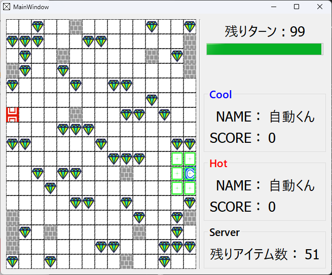
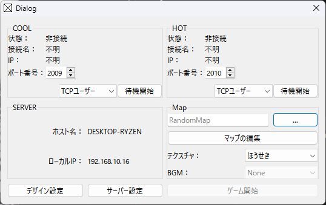
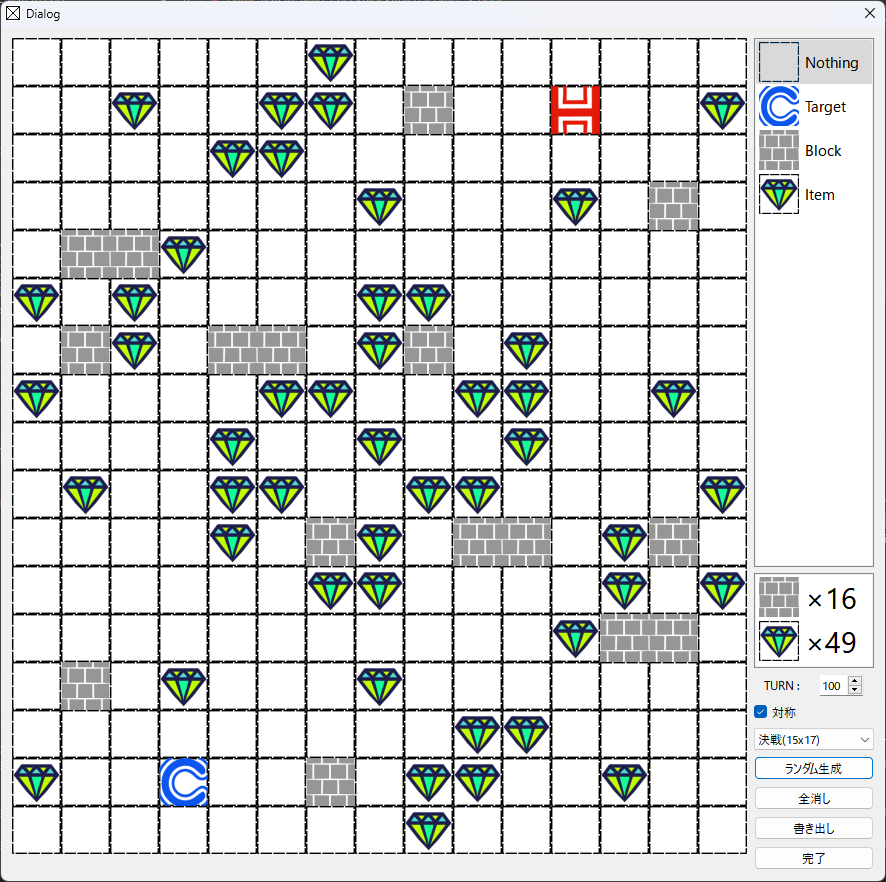

# AsahikawaProcon-Server

北海道旭川市で毎年開催される、[U-16旭川プログラミングコンテスト](http://www.procon-asahikawa.org/)で使用されるサーバーです。

ルールや通信仕様の詳細は公式サイトや同梱のdocファイル等を参照してください。

このサーバーはC++とクロスプラットフォームライブラリQtによって開発されています。
現在のサーバーではドキュメント通りの通信仕様であるため、過去に旭川プロコンに使用されたライブラリ・クライアントと互換性を持ちます。

  
  
  

## クライアント
このサーバーは通常TCPで接続するクライントを、別の特殊なクライアントで代用することが可能です。

* **TCPユーザー** 通常のクライアントです。クライアントとなるPCのAIにより動作します。
* **自動くん** 特に何もしないモードです。デバッグにどうぞ。
* **ManualClient** 別ウインドウでコントローラが開かれ、ユーザー直接を操作できます。
* **botV4** [2020年版のボットプログラム](https://www.procon-asahikawa.org/files/U16asahikawaBot.zip)が動作します。
  ただし、OSはWindows限定で ./2019-U16asahikawaBot/u16asahikawaBot.exe がある場合のみ起動可能です。

## サーバー設定
サーバーの動作設定ができます。また、**設定は再起動後有効になります。**

* **ログ保存場所** ログを保存する場所です。初期設定はカレントディレクトリになっていますが、胡散臭いので絶対パスに変えることを推奨します。
* **ゲーム進行速度** ゲーム中のアニメーションの待ち時間です。初期設定は150[ms]（1000ms=1秒）です。少ないほど高速になりますが、処理時間の都合上一定速度以下にはなりません。
* **通信タイムアウト時間** TCPクライアントにおけるレスポンスの待ち時間です。長ければ長いほどクライアントがタイムアウトしにくくなります。

## 開発環境(Qt6)
- Windows 11 23H2
- Qt Creator 13.0.1
- Desktop Qt 6.7.1 MinGW 64-bit

## 開発環境(Qt5)
- MacOSX 10.11.3 ElCapitan
- Qt Creator 3.3.0
- Desktop Qt 5.4.2 clang 64bit

